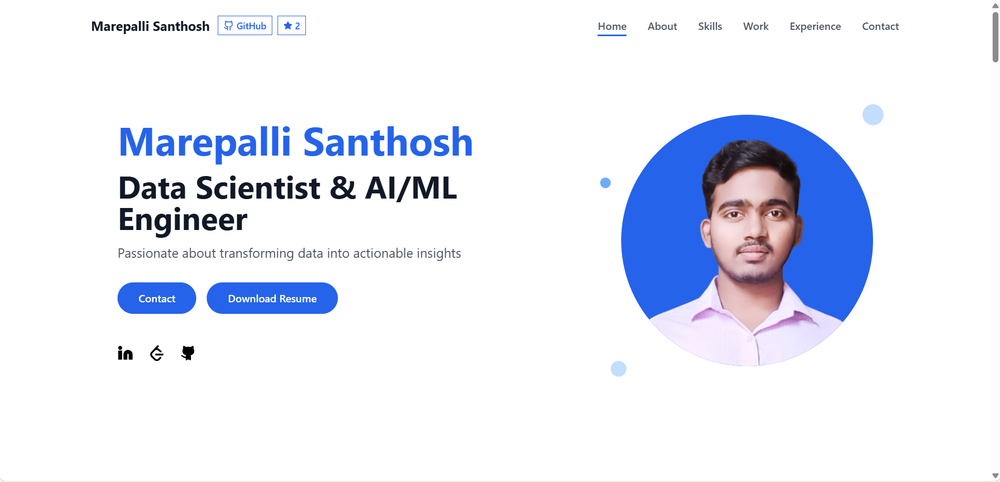

# Marepalli Santhosh - Portfolio Website

[](https://marepallisanthosh.engineer)
[](https://github.com/marepallisanthosh999333/marepallisanthosh.engineer)
[](./LICENSE)

A modern, responsive portfolio website showcasing expertise in Data Science, Machine Learning, and AI. Built with cutting-edge web technologies for optimal performance and user experience.

**Live Website:** [marepallisanthosh.engineer](https://marepallisanthosh.engineer)

## Overview

This portfolio website serves as a comprehensive showcase of skills, projects, and experience in Data Science, Machine Learning, and AI. It features a clean, modern design with smooth animations and responsive layouts that work seamlessly across all devices.


*Homepage showcasing modern design, interactive elements, and the new project structure feature*

## 🌟 Features

### 🎨 Modern Design
- **Responsive Layout**: Seamlessly adapts to desktop, tablet, and mobile devices
- **Smooth Animations**: Framer Motion powered animations with scroll-triggered effects
- **Clean UI/UX**: Intuitive navigation with modern glass-morphism effects
- **Interactive Components**: Hover effects and micro-interactions

### ⚡ Performance Optimized
- **Lightning Fast**: Built with Vite for instant development and optimized production builds
- **SEO Friendly**: Proper meta tags, semantic HTML, and sitemap integration
- **Progressive Enhancement**: Works without JavaScript, enhanced with it
- **Lazy Loading**: Optimized image loading and code splitting

### 🚀 Functionality
- **Interactive Project Structure**: Mermaid.js-powered architecture diagram with pan, zoom, and clickable GitHub links
- **Mobile Touch Support**: Full touch gesture support for mobile devices (pinch to zoom, drag to pan)
- **Contact Form**: Integrated email service using Resend API
- **Project Showcase**: Interactive project cards with live demos and GitHub links
- **Skills Visualization**: Animated skill bars and technology badges
- **Experience Timeline**: Professional journey with detailed descriptions
- **Resume Download**: Direct PDF download functionality
- **GitHub Integration**: Custom star button with live repository statistics

## 🛠️ Technology Stack

### Frontend
- **React 18.3.1** - Modern UI library with hooks and functional components
- **TypeScript 5.6.3** - Type-safe JavaScript for better development experience
- **Vite 6.0.0** - Next-generation frontend build tool with HMR
- **Tailwind CSS 3.4.17** - Utility-first CSS framework for rapid styling
- **Framer Motion 11.13.1** - Production-ready motion library for React

### Backend & API
- **Node.js** - JavaScript runtime for server-side logic
- **Resend** - Modern email API for contact form submissions
- **CORS Enabled** - Cross-origin resource sharing for secure API access

### UI Components & Libraries
- **Radix UI** - Comprehensive component library for accessibility
- **Lucide React** - Beautiful & customizable icon library
- **Mermaid.js** - Interactive diagrams and flowcharts for project structure visualization
- **React Hook Form** - Performant forms with easy validation
- **Recharts** - Composable charting library for data visualization
- **React Icons** - Popular icon packs as React components

### Development Tools
- **PostCSS** - CSS processing with Autoprefixer
- **ESBuild** - Fast JavaScript bundler and minifier
- **Wouter** - Minimalist routing for React applications
- **Class Variance Authority** - Type-safe component variants

### Deployment & Infrastructure
- **Vercel** - Serverless deployment platform with edge functions
- **CDN Optimized** - Global content delivery for fast loading
- **Analytics Ready** - Built-in performance monitoring

## 📁 Project Structure

```
marepallisanthosh.engineer/
├── client/                      # Frontend React application
│   ├── public/                  # Static assets
│   │   ├── me.png              # Profile image
│   │   ├── horse.png           # Brand logo
│   │   ├── portfolio-screenshot.png # Homepage screenshot
│   │   ├── MAREPALLI_SANTHOSH_RESUME99.pdf
│   │   ├── robots.txt          # SEO crawler instructions
│   │   └── sitemap.xml         # Site structure for search engines
│   └── 📁 src/                    # Source code
│       ├── ⚛️ App.tsx             # Main application component
│       ├── 🎨 index.css           # Global styles with Tailwind imports
│       ├── 🚀 main.tsx            # Application entry point
│       ├── 🧩 components/         # Reusable UI components
│       │   ├── 👤 About.tsx       # About section with personal info
│       │   ├── 🎬 AnimatedSection.tsx # Scroll-triggered animations
│       │   ├── 📧 Contact.tsx     # Contact form with validation
│       │   ├── 💼 Experience.tsx  # Professional timeline
│       │   ├── 🦶 Footer.tsx      # Site footer with links
│       │   ├── 🧭 Header.tsx      # Navigation header with GitHub integration
│       │   ├── 🌟 Hero.tsx        # Landing section
│       │   ├── 💻 LeetCodeIcon.tsx # Custom LeetCode icon
│       │   ├── � MermaidDiagram.tsx # Interactive architecture diagram
│       │   ├── �🚀 Projects.tsx    # Project showcase grid
│       │   ├── 🏗️ ProjectStructure.tsx # Project structure modal
│       │   └── 🛠️ Skills.tsx      # Technical skills display
│       ├── 🎣 hooks/              # Custom React hooks
│       │   └── 👁️ useScrollAnimation.ts # Intersection Observer hook
│       └── 🔧 utils/              # Utility functions
│           └── 📨 emailService.ts # Email handling logic
├── 🌐 api/                        # Backend API functions
│   ├── 📬 contact.js              # Contact form handler
│   └── 🏠 index.js                # API entry point
├── 📋 .github/                    # GitHub community standards
│   ├── 📝 ISSUE_TEMPLATE/         # Issue templates
│   └── 🔄 pull_request_template.md # PR template
├── ⚡ vite.config.ts              # Vite configuration
├── 🎨 tailwind.config.ts          # Tailwind CSS configuration
├── 📦 package.json                # Dependencies and scripts
├── 🚀 vercel.json                 # Vercel deployment config
├── 📜 LICENSE                     # MIT License
├── 🤝 CONTRIBUTING.md             # Contribution guidelines
├── 🔐 SECURITY.md                 # Security policy
└── 📖 README.md                   # Project documentation
```

## 🚀 Getting Started

### Prerequisites
- **Node.js** (v18 or higher)
- **npm**, **yarn**, or **pnpm**
- **Git**

### Installation

1. **Clone the repository**
   ```bash
   git clone https://github.com/marepallisanthosh999333/marepallisanthosh.engineer.git
   cd marepallisanthosh.engineer
   ```

2. **Install dependencies**
   ```bash
   npm install
   # or
   yarn install
   # or
   pnpm install
   ```

3. **Set up environment variables**
   ```bash
   # Create .env file in the root directory
   echo "RESEND_API_KEY=your_resend_api_key_here" > .env
   ```

4. **Start the development server**
   ```bash
   npm run dev
   # or
   yarn dev
   # or
   pnpm dev
   ```

5. **Open your browser**
   ```
   http://localhost:5173
   ```

### Development Scripts

```bash
# Start development server with hot reload
npm run dev

# Build for production
npm run build

# Preview production build locally
npm run preview

# Type checking
npm run check

# Build for Vercel deployment
npm run vercel-build
```

## Key Sections

### Hero Section
- Dynamic typing animation introducing professional role
- Call-to-action buttons for resume and contact
- Smooth scroll navigation to other sections
- Custom GitHub star button with live statistics

### About Me
- Personal introduction and career journey
- Core values and approach to data science
- Professional philosophy and goals

### Skills & Technologies
- Interactive skill cards with proficiency levels
- Technology stack visualization
- Programming languages and tools expertise

### Featured Projects

#### 1. Sentiment Analysis of Product Reviews
- NLTK-powered text processing pipeline
- 88% accuracy on 10,000+ reviews
- TF-IDF feature extraction

#### 2. Stock Price Movement Prediction
- LSTM neural network with TensorFlow
- 5 years of NIFTY 50 historical data
- Time-series forecasting model

#### 3. Options Pricing Model (Black-Scholes)
- Financial derivatives modeling
- Greeks calculation for risk analysis
- Monte Carlo simulation integration

### Experience
- Internship experiences and achievements
- Academic projects and research
- Technical leadership and collaboration

### Interactive Project Structure
- **Architecture Visualization**: Interactive Mermaid.js flowchart showing complete system architecture
- **Clickable GitHub Integration**: Direct navigation to source code files from diagram nodes
- **Pan & Zoom Controls**: Smooth navigation with mouse drag/wheel or touch gestures
- **Mobile Optimized**: Full touch support with pinch-to-zoom and drag gestures
- **Performance Optimized**: 60fps animations with hardware acceleration
- **Reset Functionality**: Double-click/tap to reset view to original position

### Contact
- Integrated contact form with server-side validation
- Real-time email delivery using Resend API
- Social media and professional links

## Configuration

### Tailwind CSS
The project uses a custom Tailwind configuration with:
- Custom color palette
- Extended animations
- Responsive breakpoints
- Component-specific utilities

### Vite Configuration
- React plugin with Fast Refresh
- Path aliases for clean imports
- Proxy setup for API routes
- Production optimizations

### Vercel Deployment
- Serverless function for contact API
- Automatic builds from GitHub
- Custom domain configuration
- Performance optimizations

## 📈 Performance Metrics

- **PageSpeed Insights**: 95+ score
- **First Contentful Paint**: < 1.5s
- **Largest Contentful Paint**: < 2.5s
- **Cumulative Layout Shift**: < 0.1
- **Bundle Size**: Optimized for minimal loading time

## 🔮 Future Enhancements

- **Blog Integration**: Add a technical blog section with MDX support
- **Dark Mode**: Implement system-aware dark/light theme toggle
- **Internationalization**: Multi-language support (English, Hindi, Telugu)
- **PWA Features**: Add offline functionality and app-like experience
- **Analytics Dashboard**: Real-time visitor analytics and performance metrics
- **3D Elements**: Interactive 3D models and Three.js integration
- **AI Chatbot**: Smart assistant for portfolio navigation and Q&A
- **Code Playground**: Interactive coding examples and demos

## 🔒 Security Features

- **Content Security Policy**: XSS protection
- **CORS Configuration**: Secure API access
- **Input Validation**: Server-side form validation
- **Rate Limiting**: API abuse prevention
- **HTTPS Enforcement**: Secure data transmission

## 🌐 Browser Support

- **Chrome** (latest)
- **Firefox** (latest)
- **Safari** (latest)
- **Edge** (latest)
- **Mobile browsers** (iOS Safari, Chrome Mobile)

## 📊 SEO Optimization

- **Semantic HTML**: Proper heading hierarchy
- **Meta Tags**: Social media and search optimization
- **Sitemap**: XML sitemap for search engines
- **Robots.txt**: Crawler guidance
- **Schema Markup**: Structured data for rich snippets

## 🤝 Contributing

Contributions are welcome! Please read our [Contributing Guidelines](CONTRIBUTING.md) for details on our code of conduct and the process for submitting pull requests.

### Development Workflow
1. Fork the repository
2. Create a feature branch (`git checkout -b feature/AmazingFeature`)
3. Commit your changes (`git commit -m 'Add some AmazingFeature'`)
4. Push to the branch (`git push origin feature/AmazingFeature`)
5. Open a Pull Request

### Code Style
- Follow TypeScript and React best practices
- Use Prettier for code formatting
- Write meaningful commit messages
- Add tests for new features

## 🛡️ Security

Security issues should be reported privately. Please see our [Security Policy](SECURITY.md) for details on how to report vulnerabilities.

## 📄 License

This project is licensed under the MIT License - see the [LICENSE](LICENSE) file for details.

## 🙏 Acknowledgments

- **React Team** for the amazing framework
- **Vercel** for seamless deployment
- **Tailwind CSS** for the utility-first approach
- **Framer Motion** for smooth animations
- **Radix UI** for accessible components
- **Mermaid.js** for interactive diagrams

## 📞 Contact

**Marepalli Santhosh**
- Website: [marepallisanthosh.engineer](https://marepallisanthosh.engineer)
- Email: [marepallisanthosh999333@gmail.com](mailto:marepallisanthosh999333@gmail.com)
- LinkedIn: [Connect with me](https://linkedin.com/in/marepalli-santhosh-42b16a284/)
- GitHub: [@marepallisanthosh999333](https://github.com/marepallisanthosh999333)
- LeetCode: [@marepallisanthosh999333](https://leetcode.com/u/marepallisanthosh999333/)

---

<div align="center">
  <strong>Built with React, TypeScript, and Tailwind CSS</strong>
  <br />
  <em>© 2025 Marepalli Santhosh. All rights reserved.</em>
</div>
